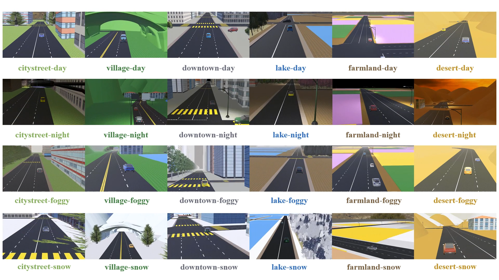

# An Open-World Cross-Scene Benchmark for Drone Visual Active Tracking
[](LICENSE)
[](document/_build/en/index.html)
[](document/_build/zh/index.html)




## Abstract
Due to the challenges of dealing with high-dynamic visual targets and complex environments in applications such as security monitoring and multi-robot collaboration, there is increasing attention on the active control of cameras. Visual active tracking, which generates control commands based on visual information to actively control camera movements, better aligns with real-world needs. Most previous works in this field adopt a serial approach, integrating visual models with control models. Still, the labeling of visual data reduces the efficiency of the workflow, while fine-tuning the control model parameters limits the generalization performance of these approaches. End-to-end active visual tracking can be achieved with reinforcement learning, which relies on simulation platforms for trial-and-error and policy learning. However, the performance of existing algorithms is frequently constrained by overly simplistic simulation environments. To overcome these limitations, we proposed the Drone Active Reinforcement Tracking(DART) benchmark, an active visual tracking platform that constructed diverse and complex real-world scenarios. We offered 24 large-scale open environments that can fully test a model's ability for cross-scenario and cross-domain transfer. Additionally, we provided common trackers, targets, and sensors that can be customized for different tasks. We proposed a baseline method based on curriculum learning and validated the platform's effectiveness through experiments. This platform will provide an important benchmark for future active vision tasks.


## Citing
```bibtex
@article{,
  title={An Open-World Cross-Scene Benchmark for Drone Visual Active Tracking},
  author={},
  journal={},
  year={},
  publisher={}
}
```