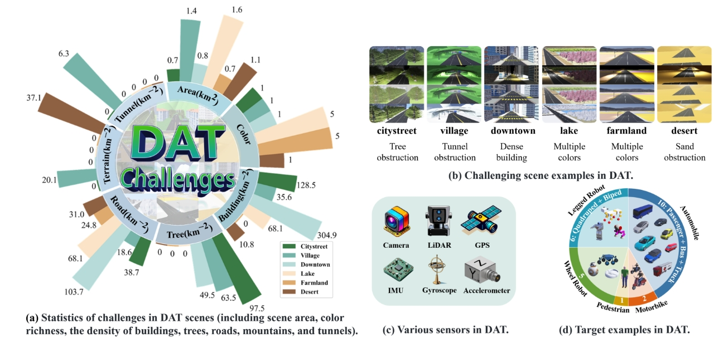

# A Cross-Scene Benchmark for Open-World Drone Active Tracking
[](LICENSE)
[](https://forcvpr2025.github.io/anonymous/)
[](https://forcvpr2025.github.io/anonymous/zh/index.html)




## Abstract
Drone Visual Active Tracking aims to autonomously follow a target object by controlling the motion system based on visual observations, providing a more practical solution for effective tracking in dynamic environments. However, accurate Drone Visual Active Tracking using reinforcement learning remains challenging due to the absence of a unified benchmark, the complexity of open-world environments with frequent interference, and the diverse behaviors of dynamic targets. To address these issues, we propose a unified cross-scene cross-domain benchmark for open-world drone active tracking called **DAT**. The DAT benchmark provides 24 visually complex environments to assess the algorithms' cross-scene and cross-domain generalization abilities, and high-fidelity modeling of realistic robot dynamics. Additionally, we propose a reinforcement learning-based drone tracking method called **R-VAT**, which aims to improve the performance of drone tracking targets in complex scenarios. Specifically, inspired by curriculum learning, we introduce a Curriculum-Based Training strategy that progressively enhances the agent tracking performance in increasingly difficult scenarios. We develop a goal-centered reward function to provide precise feedback to the drone agent, ensuring that out-of-view targets do not receive higher rewards than those within the view. Experiments demonstrate that the R-VAT has about 400% improvement over the SOTA method in terms of the cumulative reward metric.


## Citing
```bibtex
@article{ ,
  title={A Cross-Scene Benchmark for Open-World Drone Active Tracking},
  author={},
  journal={},
  year={},
  publisher={}
}
```
